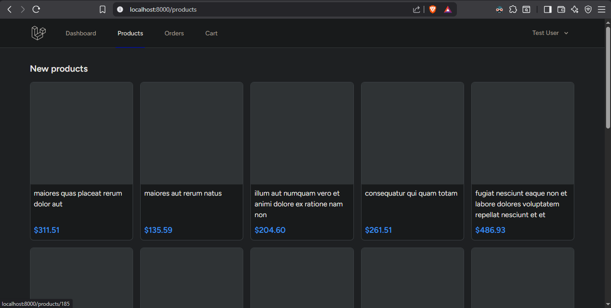
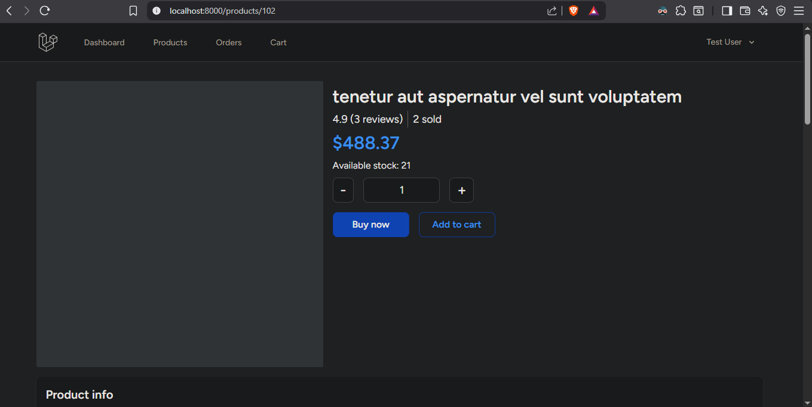
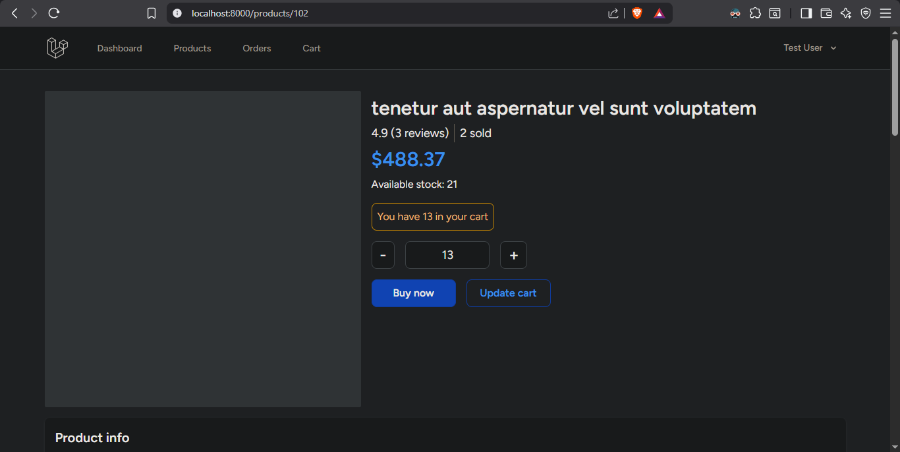
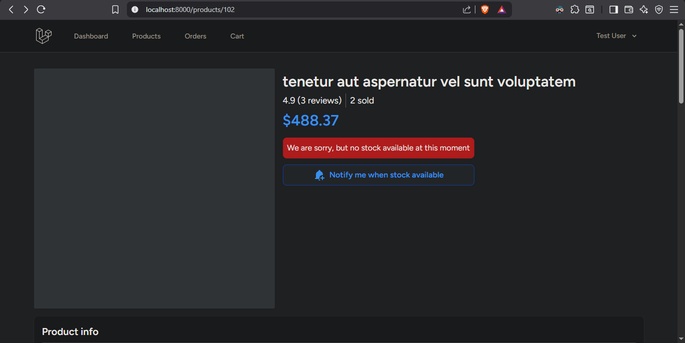
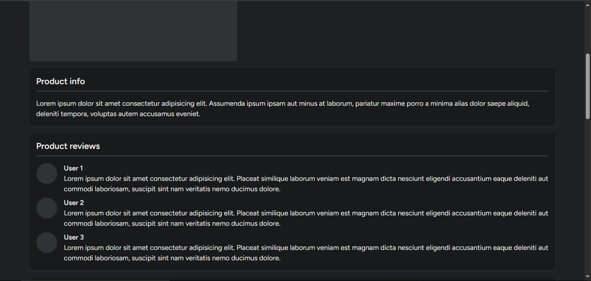
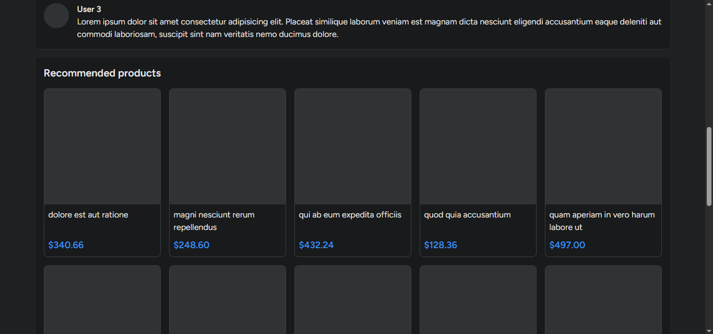
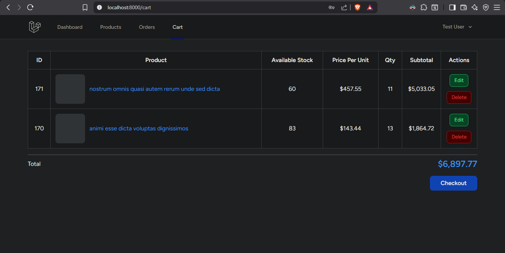
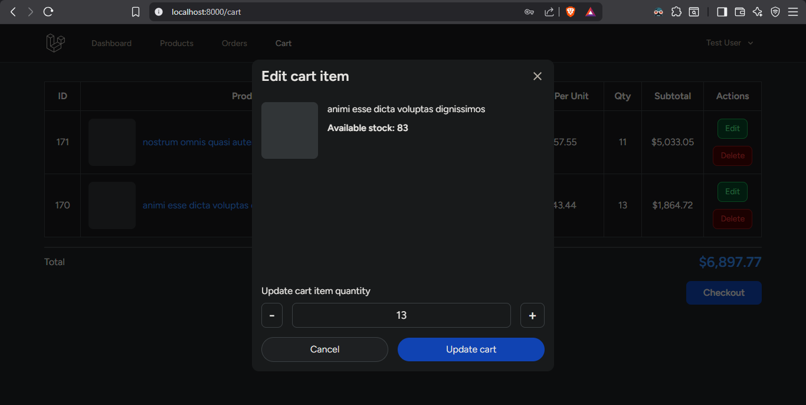
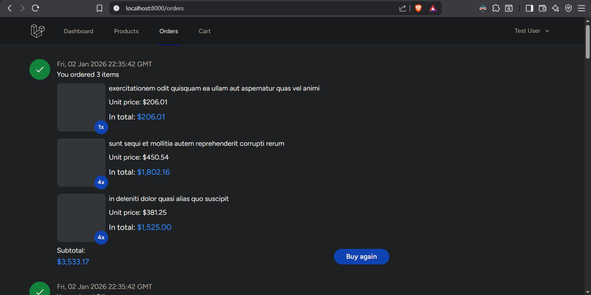

# E-commerce Shopping Cart


[](https://github.com/ChristianDelvianto/ecommerce-shopping-cart/actions/workflows/laravel-tests.yml)

[](https://codecov.io/gh/ChristianDelvianto/ecommerce-shopping-cart)

## Overview

This repository contains a simplified e-commerce flow built with Laravel, Vue 3, and Inertia.js, designed to demonstrate production-minded backend modeling, transactional correctness, and frontend–backend integration rather than UI polish.

The project intentionally mirrors real-world SME e-commerce systems, focusing on correctness, clarity, and maintainability under realistic constraints.

---

## Domain Modeling: Order & OrderItem

The `Order` and `OrderItem` models are structured to reflect real production systems:

- **Order**
    - Belongs to a user
    - Represents a finalized checkout snapshot
    - Stores totals and status at the time of purchase

- **OrderItem**
    - Belongs to an order
    - Stores product, price, and quantity at purchase time
    - Decoupled from future product price changes

This separation intentionally decouples historical orders from future product changes, ensuring data integrity for reporting, refunds, and audits.

---

## Route and Controller Structure

- **Routes**
    - `/web/cart.php` – Cart management
    - `/web/checkout.php` – Checkout process
    - `/web/orders.php` – Order history
    - `/web/products.php` – Product browsing

These routes are grouped by domain and protected with authentication and role-based middleware.

- **Controllers**
    - `Cart\IndexController` – Display cart contents
    - `Cart\CheckoutController` – Handle checkout logic
    - `Cart\DestroyCartItemController` – Remove items from cart
    - `Cart\UpsertProductController` – Add/update products in cart
    - `Order\IndexController` – Display user orders
    - `Product\IndexController` – List products
    - `Product\ShowController` – Show product details

These controllers are designed to be single-responsibility, focusing on one action per controller to enhance clarity and testability.

---

## Checkout & Data Integrity

- Checkout creates a transactional snapshot of the order and its items.
- Product price changes after checkout do not affect historical orders.
- Stock is validated atomically during checkout to prevent negative inventory.

This design prioritizes financial correctness and predictable system behavior.

---

## Trade-offs & Assumptions

Several deliberate trade-offs were made to keep the scope reviewable while preserving production realism:

- Payments are intentionally out of scope to focus on domain correctness rather than third-party integrations.
- Stock handling is implemented using database transactions with row-level locking (`lockForUpdate`) at checkout to ensure correctness under concurrent requests.
- Pre-checkout stock reservation (e.g. holding inventory while items sit in carts) is intentionally not implemented. This avoids added complexity such as expiry handling and cleanup jobs and reflects typical SME-scale assumptions where contention is moderate.
- UI complexity is deprioritized in favor of backend clarity, correctness, and testability.
- The system assumes moderate scale, where correctness and maintainability outweigh premature optimization.

These decisions are intentional, not omissions, and reflect pragmatic engineering judgment.

---

## Tests

The project includes focused tests covering:
- Successful checkout and order creation
- Checkout failure on insufficient stock
- Stock notification intent and dispatch behavior

Tests prioritize business-critical paths over exhaustive coverage.

---

## Tech Stack

- Backend: Laravel
- Frontend: Vue 3 + Inertia.js
    - Inertia is used to deliver SPA-like UX while preserving Laravel routing, authentication, and server-side control.
- Authentication: Laravel Breeze (session-based)
- Styling: Tailwind CSS
- Database: MySQL / PostgreSQL
- Queue: Laravel Jobs (`database` driver)
- Scheduler: Laravel Task Scheduling (cron)

The stack reflects common production Laravel deployments rather than experimental tooling.

---

## Screenshots

### **1. Browse products**


### **2. Product detail (main)**

<p>Displays product details, availability, and purchase actions.</p>


<p>If the product already exists in the user’s cart, a contextual UI indicator is shown with the current in-cart quantity.</p>


    
### **3. Product info & reviews**


### **4. Recommended products**


### **5. Cart**


### **6. Edit cart item**


### **7. Orders**


---

## Running the project

### Prerequisites

- PHP ^8.2
- Composer
- Node.js ^18.x and npm
- MySQL or PostgreSQL
- Git

---

### Setup

```bash
git clone https://github.com/ChristianDelvianto/ecommerce-shopping-cart.git
cd ecommerce-shopping-cart

cp .env.example .env
composer install
npm install
php artisan key:generate
php artisan migrate --seed
```

### Run (Multiple Processes Required)

```bash
# Terminal 1: App server
php artisan serve

# Terminal 2: Queue worker
php artisan queue:work

# Terminal 3: Scheduler
php artisan schedule:work

# Terminal 4: Frontend assets
npm run dev
```

This multi-process setup mirrors real Laravel production environments where web, queue, and scheduled workers run independently.

Note:
- Make sure the Laravel server is running before accessing the app
- Queue worker and scheduler must run in separate terminals
- To change the low stock threshold, update `LOW_STOCK_THRESHOLD` in `.env`

---

## Configuration Notes

- `LOW_STOCK_THRESHOLD` controls admin stock alerts
- Queue driver: `database`
- Scheduler requires a running worker
- Mail delivery depends on the configured mail driver

---

## What I Would Do Differently in Production

### High-Concurrency & System Performance
* **Robust Stock Reservation:** Implement an advanced stock reservation mechanism specifically engineered to handle high-contention purchasing scenarios without database bottlenecks.
* **Redis Integration:** Transition the application cache and background queue layers to Redis to maximize overall system performance, throughput, and horizontal scalability.
* **Production Observability:** Integrate comprehensive logging and monitoring infrastructure to ensure full operational visibility and production readiness.
* **Load Testing & Benchmarking:** Conduct extensive load testing and benchmarking to validate system performance under realistic traffic patterns and identify potential bottlenecks.
* **Database Optimization:** Implement advanced database optimization techniques, including indexing strategies, query profiling, and schema adjustments to enhance performance under high load.

### Core E-Commerce & User Experience
* **Partial Cart Checkout:** Add a fault-tolerant "double checkout" system that allows users to seamlessly proceed and purchase available items when certain products in their cart run out of stock.
* **Payment Gateway Integration:** Integrate a production-ready payment gateway to handle real commercial financial transactions securely.
* **E2E Test Automation:** Implement Playwright browser testing to automate end-to-end quality assurance, ensuring the entire operational flow functions flawlessly from the user's perspective.
* **SEO Optimization:** Implement structural SEO optimization and search visibility improvements to enhance discovery and user acquisition.

### Advanced Back-Office & Administrative Functionality
* **Dedicated Administrative Panel:** Build a standalone admin panel providing isolated spaces for product catalogs, order pipelines, and operational reporting.
* **Role-Based Access Control (RBAC):** Implement strict role-based access controls to delegate precise permissions across different administrative team roles.
* **Analytics & Reporting:** Deploy specialized sales and inventory data analytics engines to track business health and item metrics.
* **Multi-Channel Alert Infrastructure:** Upgrade the current low-stock monitoring systems into a robust notification engine capable of dispatching automated email and SMS alerts.

---

## Final Notes

This project was completed in approximately 4–5 days, including design, implementation, and refinement.